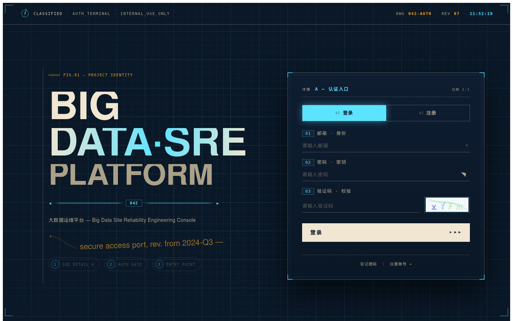
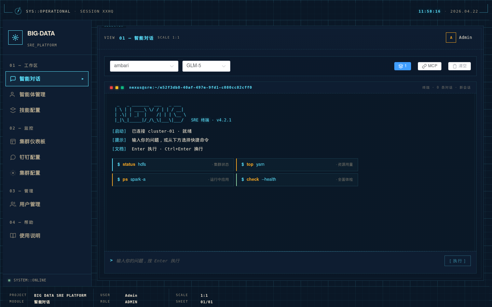
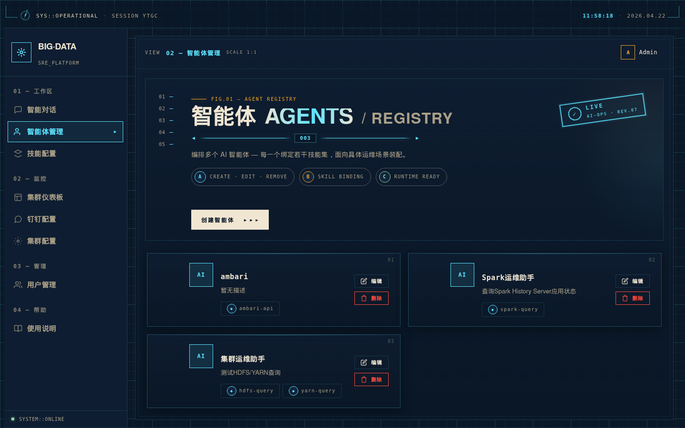

# Big Data SRE Platform

大数据智能运维平台 - 基于 AI 的智能运维助手

## 平台预览

<table>
  <tr>
    <td align="center"><b>登录页</b></td>
    <td align="center"><b>智能对话</b></td>
    <td align="center"><b>智能体管理</b></td>
  </tr>
  <tr>
    <td></td>
    <td></td>
    <td></td>
  </tr>
</table>

## 功能特性

### 核心功能

- **智能对话**: 通过自然语言与 AI 交互，查询集群状态、分析日志、排查问题
- **智能体管理**: 创建和管理多个运维智能体，配置专属技能
- **技能系统**: 模块化技能架构，支持灵活组合、链式执行，以及 ZIP/目录热导入
- **MCP 工具集成**: 直接调用 MCP 工具，绕过 AI 路由，响应更快
- **多集群管理**: 支持配置多套 Hadoop/Spark/YARN 集群，一键测试连通性并切换
- **钉钉集成**: 钉钉机器人接入、会话托管、智能体与群聊的映射管理
- **用户权限管理**: 支持管理员和普通用户角色，可配置模块访问权限，支持个人资料与密码修改
- **登录安全**: SVG 图形验证码、JWT 会话、注册/登录双重验证

### UI 特性

**工业数据终端视觉（v4.2）** — 全站重构为 `NEXUS // SRE_COMMAND` 科幻指挥中台风格：

- **登录页 HUD**：顶部任务控制状态栏（UTC 实时时钟 / 构建号 / NOMINAL 状态徽章）、视口四角框选、CRT 扫描线与噪点层、左侧纵向实时指标读数（CPU / MEM / NET / DSK / JOB 每秒刷新）、底部地理坐标条、中央全息雷达 + 轨道环 + 悬浮数据卡
- **智能对话终端**：重做为仿 shell 会话——窗口栏带交通灯 + `nexus@sre:~/<agent>` 标题、ASCII 启动 banner、`user@nexus:~$` 提示符、`[智能体] :: 完成` 响应头、`[完成] / [失败] / [警告]` 执行日志、`[ 执行 ]` 按钮
- **快捷命令**：`$ status hdfs` 等类 shell 入口代替气泡按钮，语法高亮配色
- **中英混排字体栈**：JetBrains Mono + DM Sans，配 Sarasa Mono SC / PingFang SC 中文 fallback
- **双主题支持**：浅色模式（清爽白）与深色模式（深炭 + 青/琥珀），深色模式次级文字对比度达 WCAG AA
- **色彩系统**：青色 `#14b8a6` 为主、琥珀 `#fbbf24` 为次，LED 状态指示（方形 + 光晕），告别紫色与玻璃态
- **动效编排**：启动序列（角框 → 指标 → 终端 → 品牌文案逐级淡入）、雷达扫描、轨道旋转、脉冲光环
- **响应式设计**：1180/960/480 三档断点，窄屏自动收纳侧边读数和数据卡

## 内置技能

| 技能 | 功能 | 底层集成 |
|------|------|----------|
| `hdfs-query` | HDFS 操作/状态 | WebHDFS API |
| `yarn-query` | YARN 应用/资源 | YARN REST API |
| `spark-query` | Spark 应用分析 | Spark History API |
| `ambari-manage` | 服务启停/告警 | Ambari REST API |
| `cluster-health` | 综合健康检查 | 多源聚合 |
| `data-visualization` | ECharts 图表 | GLM-4 |

## 系统架构

```
┌─────────────────────────────────────────────────────────────┐
│                        前端 (Vue 3)                          │
│  ┌─────────┐ ┌─────────┐ ┌─────────┐ ┌─────────┐           │
│  │ 智能对话 │ │集群仪表板│ │智能体管理│ │ 技能配置 │ ...       │
│  └─────────┘ └─────────┘ └─────────┘ └─────────┘           │
└─────────────────────────────────────────────────────────────┘
                              │
                              ▼
┌─────────────────────────────────────────────────────────────┐
│                     后端 (Node.js/Express)                   │
│  ┌─────────┐ ┌─────────┐ ┌─────────┐ ┌─────────┐           │
│  │ Auth API│ │ Chat API│ │Skills API│ │Settings │ ...       │
│  └─────────┘ └─────────┘ └─────────┘ └─────────┘           │
└─────────────────────────────────────────────────────────────┘
         │              │              │              │
         ▼              ▼              ▼              ▼
    ┌─────────┐   ┌─────────┐   ┌─────────┐   ┌─────────┐
    │  MySQL  │   │ GLM API │   │Hadoop   │   │ Spark   │
    │  数据库  │   │  AI模型 │   │ 集群API │   │ History │
    └─────────┘   └─────────┘   └─────────┘   └─────────┘
```

## 快速开始

### 环境要求

- Node.js 18+
- MySQL 5.7+
- GLM API Key（或其他兼容 OpenAI 接口的模型）

### 安装

```bash
# 后端
cd backend
npm install

# 前端
cd ../frontend
npm install
```

### 配置

编辑 `backend/.env`:

```env
SERVER_PORT=8080
DB_HOST=localhost
DB_PORT=3306
DB_USER=root
DB_PASSWORD=your_password
DB_NAME=bigdata_sre

# Hadoop
HADOOP_NAMENODE_URL=http://namenode:9870
HADOOP_YARN_URL=http://resourcemanager:8088

# Spark
SPARK_HISTORY_URL=http://spark-history:18080

# Ambari
AMBARI_URL=http://ambari:8080
AMBARI_USERNAME=admin
AMBARI_PASSWORD=admin

# AI 模型（支持多种）
GLM_ENABLED=true
GLM_API_KEY=your_glm_api_key
GLM_API_URL=http://api.example.com/v1/chat/completions
```

### 启动

```bash
# 后端
cd backend
npm start

# 前端（开发模式）
cd frontend
npm run dev

# 前端（生产构建）
cd frontend
npm run build
```

访问:
- 前端: http://localhost:5173
- 后端 API: http://localhost:8080/api

### 默认账号

- 管理员: `admin@bigdata.local` / `admin123`
- 登录/注册需填写 SVG 图形验证码（首次进入页面自动加载，点击图片可刷新）
- 可在用户管理页面创建其他用户，或进入个人中心修改资料与密码

## API 接口

### 认证

```http
GET    /api/auth/captcha       # 获取 SVG 图形验证码
POST   /api/auth/login         # 登录（需 captchaId + captchaCode）
POST   /api/auth/register      # 注册（需 captchaId + captchaCode）
GET    /api/auth/me            # 获取当前用户信息
PUT    /api/auth/profile       # 修改个人资料
PUT    /api/auth/password      # 修改密码
GET    /api/auth/users         # 用户列表（管理员）
PUT    /api/auth/users/:id     # 更新用户（管理员）
DELETE /api/auth/users/:id     # 删除用户（管理员）
```

### 智能体

```http
GET    /api/agents             # 获取所有智能体
POST   /api/agents             # 创建智能体
PUT    /api/agents/:id         # 更新智能体
DELETE /api/agents/:id         # 删除智能体
```

### 技能

```http
GET    /api/skills             # 获取所有技能
GET    /api/skills/:id         # 获取技能详情
PUT    /api/skills/:id         # 更新技能配置
POST   /api/skills/sync        # 同步技能定义到磁盘
GET    /api/skills/dirs        # 获取技能目录信息
GET    /api/skills/raw/:id     # 获取原始技能文件
POST   /api/skills/import      # 从 URL/路径导入技能
POST   /api/skills/import/file # 上传 ZIP 文件导入技能
```

### 对话

```http
POST   /api/chat               # 发送消息（AI 驱动，支持会话上下文）
POST   /api/chat/mcp           # 发送消息（MCP 工具模式）
POST   /api/chat/skills        # 发送消息（Skills 直调模式）
GET    /api/chat/mcp-tools     # 获取可用 MCP 工具列表
GET    /api/chat/stats         # 会话统计
DELETE /api/chat/session/:id   # 清除指定会话
```

### 集群与模型配置

```http
GET    /api/settings                    # 获取所有配置
PUT    /api/settings                    # 更新全局配置
GET    /api/settings/cluster/status     # 所有集群的连通性状态
GET    /api/settings/cluster/:id        # 获取指定集群配置
POST   /api/settings/cluster            # 新增集群
DELETE /api/settings/cluster/:id        # 删除集群
POST   /api/settings/test-connection    # 测试集群连接
POST   /api/settings/model              # 添加 AI 模型
PUT    /api/settings/model/:id          # 更新模型配置
DELETE /api/settings/model/:id          # 删除模型
POST   /api/settings/model/:id/set-default # 设为默认模型
POST   /api/settings/test-ai            # 测试 AI 模型连接
```

### 钉钉集成

```http
POST   /api/dingtalk/chat               # 钉钉机器人入口（回调）
GET    /api/dingtalk/status             # 机器人运行状态
GET    /api/dingtalk/config             # 获取配置
PUT    /api/dingtalk/config             # 更新配置
POST   /api/dingtalk/test-connection    # 测试钉钉连接
GET    /api/dingtalk/health             # 健康检查
POST   /api/dingtalk/update-status      # 主动上报状态
GET    /api/dingtalk/agent-mappings     # 群聊 ↔ 智能体映射
POST   /api/dingtalk/agent-mappings     # 新建映射
DELETE /api/dingtalk/agent-mappings/:id # 删除映射
```

## 使用示例

### 创建智能体

```bash
curl -X POST http://localhost:8080/api/agents \
  -H "Content-Type: application/json" \
  -H "Authorization: Bearer <token>" \
  -d '{
    "name": "Hadoop运维助手",
    "description": "Hadoop集群运维智能体",
    "skills": ["hdfs-query", "yarn-query", "cluster-health"]
  }'
```

### 发送消息

```bash
curl -X POST http://localhost:5173/api/chat \
  -H "Content-Type: application/json" \
  -H "Authorization: Bearer <token>" \
  -d '{
    "agent_id": "<agent_id>",
    "message": "查一下 HDFS 磁盘使用情况并画成图"
  }'
```

### 支持的查询示例

| 查询类型 | 示例语句 |
|---------|---------|
| HDFS 状态 | "查一下 HDFS 集群状态"、"HDFS 磁盘使用情况" |
| YARN 资源 | "YARN 资源使用情况"、"列出运行中的应用" |
| Spark 应用 | "正在运行的 Spark 应用"、"Spark 任务为什么慢" |
| 集群健康 | "检查集群健康状态"、"全面健康检查" |
| 日志分析 | "分析这个应用的日志"、"查看错误日志" |

## 技术栈

**前端**:
- Vue 3 (Composition API)
- Vite 构建工具
- Element Plus UI 组件库
- ECharts 图表库（动态渲染 AI 生成的图表）
- Axios HTTP 客户端
- JetBrains Mono + DM Sans + Sarasa Mono SC 字体栈

**后端**:
- Node.js / Express
- MySQL 数据库
- JWT 认证
- svg-captcha（图形验证码）
- multer（ZIP 技能包上传）
- MCP 协议支持
- 钉钉 Stream SDK

**AI**:
- GLM-4 / GLM-5 (智谱 AI)
- 支持多种兼容 OpenAI 接口的模型

## 项目结构

```
bigdata-sre-platform/
├── frontend/                       # 前端项目
│   ├── public/
│   │   └── favicon.svg             # 青色六边形波形 favicon
│   ├── src/
│   │   ├── components/             # Vue 组件
│   │   │   ├── LoginPage.vue       # NEXUS HUD 登录页
│   │   │   ├── ChatView.vue        # 终端风格对话
│   │   │   ├── ClusterDashboard.vue
│   │   │   ├── AgentManagement.vue
│   │   │   ├── SkillManagement.vue
│   │   │   ├── ClusterConfig.vue
│   │   │   ├── DingtalkConfig.vue
│   │   │   ├── UserManagement.vue
│   │   │   ├── UserGuide.vue
│   │   │   └── EChartRenderer.vue
│   │   ├── styles/                 # theme.css 等
│   │   ├── utils/
│   │   └── App.vue
│   └── package.json
├── backend/                        # 后端项目
│   ├── src/
│   │   ├── config/                 # 配置加载
│   │   ├── models/                 # 数据模型
│   │   ├── routes/                 # API 路由
│   │   ├── services/               # 业务服务（AI、钉钉、集群适配）
│   │   ├── tools/                  # MCP 工具注册
│   │   ├── utils/                  # 工具函数
│   │   ├── captchaStore.js         # 验证码内存存储
│   │   └── index.js                # 入口文件
│   └── package.json
├── docs/superpowers/               # 设计规格与计划
├── DESIGN.md                       # 设计理念
├── DOCKER.md                       # 容器化部署说明
└── README.md
```

## License

MIT